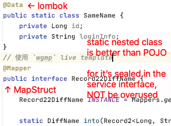
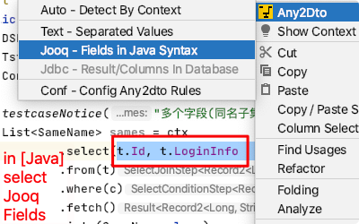
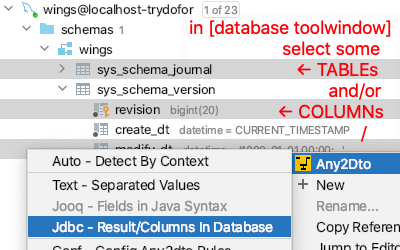
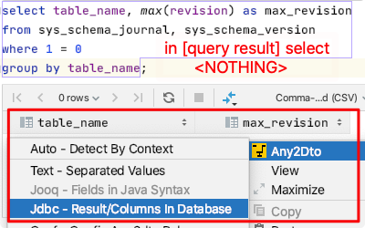

# Intellij Any2dto

在高质量的敏捷开发中，强类型和限制使用，是代码重构和数据模型变更的有利保证。  
in high quality Agile development, strong-type and data-limit
are the guarantee for code refactoring and data model changes.

然而遗憾的是，在大多数项目中，数据库访问层(DAL)违背以上实践，情形如下。  
Unfortunately, in most projects, the database access layer (DAL)
goes against the above best practice, as follows.

 * SQL语句是文本的，重构时只能基于文本查找。  
   SQL statements are text-based, code refactor based on text search.
 * 基于生成的POJO，大量`select *`选择多余的字段。  
   Based on the generated POJO, most usage is `select *` with useless fields.
 * 大量DTO转换，且一般是基于反射的动态转换。  
   Too many DTO conversions, and convert by reflect dynamically.

Any2Dto插件，可以根据数据库和JavaCode生成强类型且精确字段的DTO。  
Any2Dto plug-in generate strong-type and exact fields DTOs
by database query or JavaCode.

## Usage/用法

推荐在service中使用静态内类作为DTO，这样可以限制DTO在外部被乱用，而DTO的转换
可以通过wings提供的 live template 直接生成 MapStruct 代码。  
It is recommended to use static inner classes as DTOs in services,
which can limit the usage outside of the service. conversion of DTO
can be generated by wings's live template using MapStruct.

### Jooq Fields in DSL

在编辑的Java代码中，选择Jooq预定义的字段，可生成与之对应的强类型DTO。  
In the Java Editor, select Jooq's fields to generate the strong type DTO.

### Table/Column in Database ToolWindow

在Database工具窗（依赖Database插件）选择表和字段，为选择的所有字段生成DTO。
需要注意的是，有时需要SQL到Java的类型绑定，或同名字段调整。  
In the Database tool window (need Database plugin), Select tables or columns
to generate DTOs for all selected fields. Note, sometimes it needs modify
the sql-to-Java type-mapping, or the same name field.

### Column in Query Result

在数据库控制台（依赖Database插件）验证业务`SELECT`是否正确，并直接为所有查询字段生成DTO。
需要注意的是，此方法通常需要的类型绑定或字段调整。
In database console (need Database plugin), verify the business `SELECT` result,
and generate DTOs directly for all query fields. Note, generally it needs
modify the sql-to-Java type-mapping, or the same name field.

### NonWord Separated Values

TODO 非词分隔的文本，如CVS，TSV，相当于进行列编辑或正则替换。

### Configure Any2Dto in Project

TODO 为每个工程提供独立的配置

## Description
<!-- Plugin description -->
Commonly using generated Pojo to `SELECT *` is a bad practice. the better way
is `SELECT ONLY, WHAT, YOU, NEED` and generate the exact DTO automatically.

Generate DTO code by selected JavaCode, DbColumn, SqlResult, ValuedText.

Right click the selection in JavaEditor, SqlConsole or DatabaseView,
and choose `Any2Dto` in the popup menus, then, the DTO code will
be Generated to clipboard or package with pre-configured rules.

 * JooqCode - select Jooq's Fields in DSL, StrongType
 * SqlResult - right click query Result View, MappedType
 * Database - select columns in Database ToolWindow, MappedType
 * ValuedText - select any Non-Java-Word separated values, GuessType

for more detail usage, go to [github any2dto](https://github.com/trydofor/intellij-any2dto/)
<!-- Plugin description end -->

## Installation

- Using IDE built-in plugin system:
  
  <kbd>Preferences</kbd> > <kbd>Plugins</kbd> > <kbd>Marketplace</kbd> > <kbd>Search for "Any2dto"</kbd> >
  <kbd>Install Plugin</kbd>
  
- Manually:

  Download the [latest release](https://github.com/trydofor/intellij-any2dto/releases/latest) and install it manually using
  <kbd>Preferences</kbd> > <kbd>Plugins</kbd> > <kbd>⚙️</kbd> > <kbd>Install plugin from disk...</kbd>

## Change Notes
<!-- Plugin changeNotes -->
 * 1.0.0 support Jooq's Fields in Java; SQLs in DataGrid; Text & Auto at AnyWhere
<!-- Plugin changeNotes end -->

## Moilion Product

 * [redis-replicator](https://github.com/leonchen83/redis-replicator)
   Redis Replicator implement Redis Replication protocol written in java. It can parse,
   filter, broadcast the RDB and AOF events in a real time manner. It also can synchronize
   redis data to your local cache or to database.
 * [moilioncircle](http://www.moilioncircle.com)
   sharing any topic, skill to make life easier & happier.
 * [godbart](https://github.com/trydofor/godbart)
   go-db-art, a SQL-based CLI for RDBMS schema versioning & data migration
 * [dota `wings`](https://github.com/trydofor/pro.fessional.wings)
   java bootstrap of springboot for startup team to fast refactor and fast delivery.
   type-safe, compile-time, db-schema & table-record can be versioned.
 * [dota `meepo`](https://github.com/trydofor/pro.fessional.meepo)
   a comment-base template engine for any program language.
 * [dota `mirara`](https://github.com/trydofor/pro.fessional.mirana)
   a java common library for id, text, time, code, etc.
